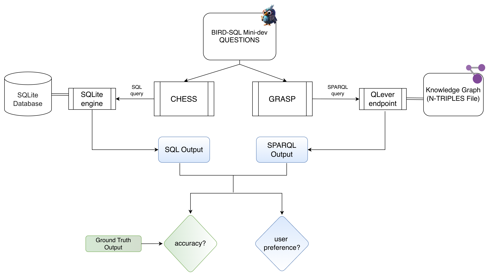
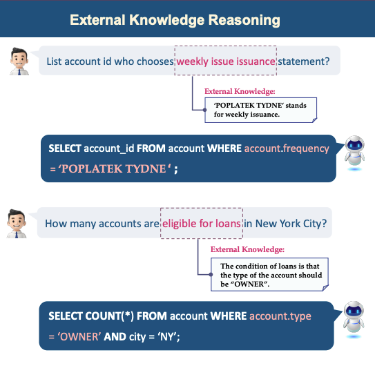

We're exploring whether the way data is modeled - Relational or RDF - impacts question answering quality in the semantic parsing setting. By converting a standard relational benchmark into RDF, we pit Text2SQL against Text2SPARQL on the same set of questions. The goal isn't just comparing accuracy, but whether the RDF data model offers advantages in how answers are presented and perceived especially for complex queries.
<!--more-->

### Long story short
We took the same 500 questions and ran them against the same underlying data - once in a relational database, once as an RDF knowledge graph. A state-of-the-art Text2SQL system ([CHESS](https://github.com/ShayanTalaei/CHESS)) went up against a Text2SPARQL system ([GRASP](https://github.com/ad-freiburg/grasp)).

CHESS wins on accuracy. GRASP wins on user preference - in **64%** of cases. And GRASP costs **8× less** to run.

The evaluation scripts and final results are available in my [GitHub repository](https://github.com/surbhi-nair/rel-vs-rdf-qa).

## Content

- [Introduction](#introduction)
- [Motivation](#motivation)
- [Goal](#goal)
- [Implementation](#implementation)
    - [The base benchmark](#the-base-benchmark)
    - [Converting to RDF](#converting-to-rdf)
    - [The Contenders](#the-contenders)
        - [Text2SQL: CHESS](#text2sql)
        - [Text2SPARQL: GRASP](#text2sparql)
- [Evaluation Setup](#evaluation-setup)
    - [F1 Score](#strict-f1-score)
    - [Relaxed F1 Score](#relaxed-f1-score)
    - [LLM Judges](#llm-as-judge-evaluation)
        - [Accuracy Judgement](#accuracy-judge)
        - [Preference Judgement](#preference-judge)
- [Results](#results)
    - [F1 Score Results](#f1-score-results)
    - [LLM Judge Results](#llm-judge-results)
- [Dive into the Results](#discussion)
    - [Where SPARQL fails](#where-sparql-fails)
    - [Where SPARQL shines](#where-sparql-shines)
    - [Does evidence help?](#does-evidence-help?)
    - [What about the cost?](#what-about-the-cost)
- [Conclusion](#conclusion)

## Introduction
Structured data question answering has long been dominated by relational databases and SQL. Tools, benchmarks, and leaderboards have been built around the SQL paradigm, and the field's progress is measured almost entirely in terms of how well a system can translate a natural language question into a correct SQL query. Meanwhile, RDF knowledge graphs and SPARQL have quietly matured as an alternative data model, one with a different philosophy and different strengths.

*But how do the two actually compare when put on equal footing?* 

## Motivation
Natural language interfaces to structured data follow the same basic idea: take a question in natural language, generate a formal query to get data from the underlying data source, get an answer. The two paradigms - SQL over relational databases, and SPARQL over RDF knowledge graphs - have been doing it completely separately from each other. 

These two worlds have never been made to compete on the same ground. Existing SQL benchmarks use relational databases. Existing SPARQL benchmarks use knowledge graphs built from entirely different data. To the best of our knowledge, no one has taken the same databases, converted them to both representations, posed the same questions to both, and asked: *does the data model make a difference?* 

There's also a measurement problem. Most relational benchmark evaluations rely on exact match, execution accuracy, or F1 scores - metrics that were designed with SQL outputs in mind. Applying them directly to SPARQL results introduces a systematic bias we will get into later.

<!-- 
To the best of our knowledge, no prior study has attempted a direct, symmetric comparison of Text2SQL and Text2SPARQL on the same underlying data with the same questions on this scale. If you know of one, [please reach out](mailto:surbhi.nair@email.uni-freiburg.de) - we'd love to know!
 -->

## Goal
The goal is to level the playing field. Concretely, this means three things:

**Synchronized underlying data.** We take a standard, well-established relational QA benchmark and convert its databases into RDF knowledge graphs - same data, same questions, two representations.

**Comparative evaluation.** We run a Text2SQL agent on the relational databases and a Text2SPARQL agent on the converted knowledge graphs, and evaluate both using the same questions and the same metrics.

**Holistic metrics.** Traditional SQL evaluation metrics don't translate cleanly to SPARQL outputs. So we also design a fairer evaluation setup to better capture answer quality across both systems.


A key caveat upfront: we are running a Text2SPARQL system on a *converted relational benchmark*. The knowledge graphs we use are RDF twins of relational databases, not native knowledge graphs. We want to see how well GRASP can cope with, and measure up against, SQL benchmark databases in terms of performance.


## Implementation
Let's talk about what we actually did.

The setup has three moving parts: picking the right benchmark to build on, converting its databases into RDF, and selecting two agents to pit against each other. Each of these turned out to be more involved than it sounds.
### The base benchmark

The first decision was which relational QA benchmark to convert. The criteria were simple: it had to be realistic, well-maintained, and already have a strong leaderboard to pick our Text2SQL contender from. The main candidates were:

- [Spider](https://yale-lily.github.io/spider) - the classic cross-domain benchmark that put semantic parsing on the map. Its databases are deliberately clean and small, designed to test schema understanding rather than real-world data handling. Too clean and too old for our purposes.
- [Spider 2.0](https://spider2-sql.github.io/) - the successor, designed for enterprise-scale complexity with much larger schemas, real company data, and substantially harder queries. Excellent for pushing the frontier, but its sheer complexity and scale make it expensive to to convert and run in a controlled comparison.
- [BIRD-SQL](https://bird-bench.github.io/) (**BI**g Bench for La**R**ge-scale **D**atabase Grounded Text-to-SQL Evaluation) is the one we picked. BIRD is grounded in real-world, noisy databases spanning more than 37 professional domains. It focuses on database-grounded reasoning, requiring agents to not only understand the schema but also the actual values within the tables. 


The full BIRD benchmark has 12,751 question-SQL pairs across 95 databases. For practical reasons - cost, conversion effort, and the feasibility of running two agent systems end-to-end - we used the [BIRD-SQL Mini-dev](https://github.com/bird-bench/mini_dev) subset provided by the BIRD team: 500 curated question-SQL pairs across 11 databases.


Each entry in the benchmark looks like this:
```json
  {
    "question_id": 1505,
    "db_id": "debit_card_specializing",
    "question": "Among the customers who paid in euro, how many of them have a monthly consumption of over 1000?",
    "evidence": "Pays in euro = Currency = 'EUR'.",
    "SQL": "SELECT COUNT(*) FROM yearmonth AS T1 INNER JOIN customers AS T2 ON T1.CustomerID = T2.CustomerID WHERE T2.Currency = 'EUR' AND T1.Consumption > 1000.00",
    "difficulty": "simple"
  }
```
A few things worth noting about this format. 
- Each question has a unique `question_id`, a `db_id` linking it to a specific database, and a ground truth `SQL` query.
- There's also an `evidence` field - external knowledge that can be optionally used to help an agent map domain-specific language to database values.
- And questions are labeled with a `difficulty` rating (simple, moderate, challenging), giving us a way to break down performance by complexity.

### Converting to RDF
The next step was to produce an RDF twin of each of the 11 SQLite databases. Typically, for this kind of conversion, we need a mapping language to specify how the relational schema and data should be transformed into RDF triples. And then we need a conversion engine to execute those mappings against the actual databaseand generate the RDF knowledge graph.


The conversion pipeline has two ingredients: an [RML](https://rml.io/specs/rml/) (RDF Mapping Language) file per database, and [morph-kgc](https://morph-kgc.readthedocs.io/en/stable/) as the 
execution engine. morph-kgc takes the RML files as input and outputs RDF triples. The result for each database is a `.nt` file (N-Triples serialization), which was then loaded into a dedicated QLever endpoint for SPARQL querying.



Across the 11 databases with 75 tables in total, the resulting knowledge graphs ranged from 110 MB to 1.64 GB in N-Triples format, reflecting the variation in database size and density across domains.

#### RDF Mapping Language
The most basic structure of an RML mapping file is a **Triples Map**. Each Triples Map connects a data source to a pattern for generating RDF triples, and contains three parts:
- a **logical source** (where to get the data from, how to access/iterate)
- a **subject map** (templates for generating IRIs for the subject)
- one or more **predicate-object maps**

```t
# RML mapping file example
@prefix rr: <http://www.w3.org/ns/r2rml#> .
@prefix rml: <http://semweb.mmlab.be/ns/rml#> .
@prefix ql: <http://semweb.mmlab.be/ns/ql#> .
@prefix ex: <http://example.com/ns#> .

<#TriplesMap>
    rml:logicalSource [
        rml:source "db.sqlite" ;                   # Or a table name, CSV, JSON, etc.
        rml:referenceFormulation ql:SQL ;          # Or ql:CSV, ql:JSONPath, etc.
    ] ;
    rr:subjectMap [
        rr:template "http://example.com/{ID}" ;   # How to construct the triple subject
        rr:class ex:Entity ;                      # Optional: class/type of subject
    ] ;
    rr:predicateObjectMap [
        rr:predicate ex:hasAttribute ;
        rr:objectMap [ rml:reference "Value" ] ;  # Or rr:column/rr:constant/rr:template, etc.
    ] .
```

[Here](https://github.com/surbhi-nair/rel-vs-rdf-qa/blob/main/experiments/bird_minidev/european_football_2/european_football_2.rml.ttl)'s one of the RML files we wrote for one of the databases for reference.

#### What the mappings had to handle
An automatic mapping tool can generate a "direct mapping" from a relational schema. But that would faithfully inherit every structural quirk, naming inconsistency, and data quality issue from the source. So we extended the base mappings with a set of pragmatic, domain-aware fixes. Here's what came up.

- **Implicit foreign keys.** Some databases had relationships between tables that weren't declared as formal foreign key constraints in the SQLite schema. Without explicit constraints, an automatic mapping has no way to know these links exist - it produces disconnected island nodes in the graph. We traced these relationships manually from the data and the BIRD database descriptions, and encoded them explicitly via compound IRI templates:
```t
rr:subjectMap [
  rr:template "http://debitcard.org/consumption/{CustomerID}-{Date}" ;
  rr:class dcs:MonthlyConsumption
] ;
```

This ensures that related entities in different tables resolve to the same node in the graph, preserving the join semantics of the original relational model.

- **Semantic enrichment via RDFS comments.** Moving to RDF lets us attach human-readable metadata to schema elements. We encoded BIRD's domain explanations as `rdfs:comment` annotations on properties. 
```t
ef:attacking_work_rate rdfs:comment "high: implies that the player is going to be in all of your attack moves; medium: implies that the player will select the attack actions he will join in; low: remain in his position while the team attacks" .
```
- **Messy string and date values.** Several text columns contained characters that are syntactically problematic in RDF serializations - particularly double quotes, raw newline characters embedded in string values and dates as strings without an enforced format throughout. These had to be sanitized before they could be safely written into triples, for example:
```sql
REPLACE(text, '"', '''') AS text
REPLACE(REPLACE(text, '"', ''''), '\n', '\\n') AS text
REPLACE(date, ' ', 'T') AS date
```


Without this sanitization, the N-Triples output contains malformed literals that can corrupt parts of the knowledge graph - with no proper error logs from morph-kgc.


- **Boolean and coded values.** Some columns stored boolean or categorical data as raw integers. A direct mapping would expose these as bare numeric literals, making them opaque to any agent trying to match human-readable values. We decoded them explicitly in the mappings:
```sql
CASE Magnet WHEN 1 THEN 'Yes' WHEN 0 THEN 'No' ELSE 'Unknown' END AS magnet_status
```
- **Problematic column names.** Some databases had column names containing spaces, special characters, or cryptic abbreviations. These were normalized at the mapping level into clean, readable RDF property URIs.


The outcome: 11 RDF knowledge graphs that are semantically equivalent to their relational counterparts - same data, same relationships, same domain coverage - but expressed in a clean, well-structured RDF model. Together with the original 11 SQLite databases, these form the symmetric foundation of our comparison.


### The Contenders
Now that we have the same data in both formats, we need two agents to compete on the same 500 questions. The selection criteria were straightforward: both systems had to be state-of-the-art, open-source, and operable on our setup without fundamental modifications.
#### Text2SQL: CHESS
[CHESS](https://github.com/ShayanTalaei/CHESS)(Contextual Harnessing for Efficient SQL Synthesis) is a multi-agent Text2SQL framework by Talaei et al. at Stanford and the University of Alberta. It ranks among the top open-source methods on the BIRD leaderboard with an upper bound of 71.10% accuracy on the BIRD test set while requiring approximately 83% fewer LLM calls. Open-source, well-documented, already benchmarked on the BIRD database and it comes from a academic research group similar to the one that developed GRASP: the natural choice.
[^1]

CHESS[^1] is built around four specialized agents arranged in a sequential pipeline:
- The Information Retriever (IR) extracts relevant database values and schema context. It uses locality-sensitive hashing to efficiently retrieve values from large databases, combined with vector similarity search over database catalogs to pull in relevant column descriptions and table metadata.
- The Schema Selector (SS) addresses the problem of large schemas overwhelming the LLM context. It prunes the full database schema down to the subset of tables and columns most relevant to the question, reducing token usage by up to 5× while preserving accuracy.
- The Candidate Generator (CG) takes the pruned schema and retrieved context and generates SQL query candidates, executing and iteratively refining them based on results.
- The optional Unit Tester (UT) validates the final candidate by generating natural language unit tests and scoring the query against them, selecting the highest-scoring output as the final answer.

The pipeline is front-loaded: CHESS does significant work upfront - retrieving values, pruning the schema, assembling context - before the actual query generation step. This design reflects the SQL paradigm well: the schema is fully known in advance, columns have fixed types, and the retrieval problem is essentially about finding which parts of a known structure are relevant.


#### Text2SPARQL: GRASP
[GRASP](https://github.com/ad-freiburg/grasp)(Generic Reasoning And SPARQL Generation across Knowledge Graphs) is the Text2SPARQL system that we selected for our RDF-side contender. It uses an LLM to explore a knowledge graph dynamically - strategically executing SPARQL queries and searching for relevant IRIs and literals until it arrives at a query that correctly answers the given question. 

GRASP's approach is fundamentally exploratory. Given a question and a generic prompt, it enters a loop: query the graph, reason about the results, decide what to try next. To support this, GRASP maintains two search indices over each knowledge graph - a prefix-keyword index for entity lookup and a vector similarity index for property search - allowing it to resolve natural language mentions to their correct IRIs.

**How the two systems differ**

Setting aside the SQL vs. SPARQL distinction, we can see how CHESS and GRASP differ in their overall approach to the question answering task.

| | CHESS | GRASP |
|---|---|---|
| Context assembly | Upfront, pre-packaged | Discovered dynamically |
| Schema knowledge | Retrieved before generation | Explored during generation |
| Error recovery | Unit Tester post-generation | Built into exploration loop |
| Feel | Filtered synthesis pipeline | Interactive reasoner |


CHESS arrives at query generation with a fully assembled, static picture of the relevant database. GRASP starts with a blank slate and figures it out as it goes.


So, finally for our setup, we have something like this. We just run the same 500 questions against the same underlying data - once in a relational database, once as an RDF knowledge graph. The two systems are given the same question and the same evidence (where applicable), and we compare their outputs using the same evaluation metrics. What those metrics are, and how we designed them to be fair to both systems, is the next section.


## Evaluation Setup
Comparing the output of a Text2SQL system against a Text2SPARQL system is not as straightforward as it might seem. The standard BIRD evaluation metric was designed with SQL outputs in mind, and applying it directly to SPARQL results introduces a systematic bias against GRASP. We therefore used three evaluation approaches: 
- the original BIRD F1 score as a baseline, 
- a custom [relaxed F1](#relaxed-f1-score) that corrects for SPARQL-specific output quirks, and 
- LLM-based judgment for both correctness and user preference.

### Strict F1 Score

The original BIRD minidev evaluation uses a [Soft F1 score](https://github.com/bird-bench/mini_dev?tab=readme-ov-file#soft-f1-score) in addition to the simple execution accuracy. Instead of asking "did the query return exactly the right result set?", it measures how close the predicted result is to the ground truth at the value level - computing precision and recall over matched cell values across rows, then combining them into an F1 score. This is already an improvement over binary execution accuracy, since a query that gets most values right but misses one column still receives partial credit.

The metric works by aligning predicted rows to ground truth rows positionally - row 1 of the prediction is compared to row 1 of the ground truth, row 2 to row 2, and so on. Within each row pair, it counts how many values match, and aggregates this into precision, recall, and F1 across all rows.

The key idea: for each row pair (predicted row *n* vs. ground truth row *n*), count how many values match. Aggregate this into precision, recall, and F1 across all rows.


Here's a concrete example taken from the BIRD Mini-dev [documentation](https://github.com/bird-bench/mini_dev?tab=readme-ov-file#soft-f1-score). The predicted table has the same values as the ground truth, just in a different column order:

**Ground truth:**

| Row | | |
|---|---|---|
| 1 | 'Apple' | 325 |
| 2 | 'Orange' |  |
| 3 | 'Banana' | 119 |

**Prediction:**
| Row | | |
|---|---|---|
| 1 | 325 | 'Apple' |
| 2 | 191 | 'Orange' |
| 3 |  | 'Banana' |

Value-level match per row:

| | Matched | Pred only | Gold only |
|---|---|---|---|
| Row 1 | 2 | 0 | 0 |
| Row 2 | 1 | 1 | 0 |
| Row 3 | 1 | 0 | 1 |
| | tp = 4 | fp = 1 | fn = 1 |

`Precision = tp / (tp + fp) = 4 / 5 = 0.8`

`Recall = tp / (tp + fn) = 4 / 5 = 0.8`

`F1 = 2 * Precision * Recall / (Precision + Recall) = 0.8`

This is already more lenient than exact match - a query that gets most 
values right but misses one column still gets partial credit.



### Relaxed F1 Score

While the BIRD F1 is reasonable for SQL-vs-SQL comparison, applying it to SPARQL outputs revealed three systematic failure modes that penalize GRASP for reasons unrelated to answer correctness.

**1. Row order sensitivity.** The BIRD metric aligns rows positionally - row 1 of the prediction against row 1 of the ground truth. SPARQL endpoints don't guarantee ordering unless explicitly specified, so two identical answer sets in different orders can score well below 1.0.


Question: "Please list the disparate time of the transactions taken 
           place in the gas stations from chain no. 11."
```
Gold SQL output:       SPARQL output:
  Time                   time
  --------               --------
  14:29:00               11:55:00   ← same values,
  11:55:00               14:29:00   ← different order
```
Both outputs are fully correct. The original positional F1 score disagrees.


**2. Extra columns penalized.** GRASP frequently returns additional columns alongside the answer - labels, related properties, or contextual information that the KG naturally surfaces. The BIRD metric treats any value in the prediction that has no counterpart in the ground truth as a false positive, penalizing GRASP for being more informative. Consider this example:


Question: In 2012, who had the least consumption in LAM?
```
Gold SQL output:              SPARQL output:
  CustomerID                   customer / customerLabel / totalConsumption
  ----------                   ----------------------------------------
  47273                        http://debitcard.org/customer/47273
                               "Customer 47273 (LAM)"
                               0.74
```
The metric sees three values where it expected one, and scores the row poorly even though the correct answer is present.


**3. IRI values instead of bare literals.** The above example also illustrates a third issue. In some cases, GRASP correctly identifies the right entity but returns its full IRI (`http://debitcard.org/customer/47273`) rather than the bare integer `47273`. The answer is semantically correct, but the string comparison fails even though the returned output is correct.

The **relaxed F1 score** addresses all three issues:

| Issue | Standard F1 | Relaxed F1 |
|---|---|---|
| Row ordering | Positional alignment(index-wise comparison) | Greedy best-match (order preserved only when gold SQL has `ORDER BY`) |
| Extra columns | Penalized as false positives | Ignored - precision/recall computed over matching columns only, not extra columns |
| IRI values | String mismatch | Not double-penalized |


The gap between the two F1 scores turns out to be a direct measure of how much the standard metric systematically undercounts GRASP's actual answer quality. We'll see exactly how large that gap is in the [results](#f1-score-results).


### LLM-as-Judge Evaluation

Script-based metrics have a fundamental limitation: they compare output values mechanically, without understanding whether an answer is semantically correct in context. To complement the F1 evaluation, we used **GPT-5-mini** as a judge - assessing outputs with human-like reasoning about correctness and quality.

We designed two distinct judge types, each answering a different question about the comparison.

#### Accuracy Judge

*Is each system's answer correct with respect to the ground truth?*

The judge evaluates CHESS and GRASP independently, classifying each as `CORRECT`, `WRONG_ANSWER`, or `EXECUTION_ERROR`. SPARQL outputs get one additional category: `SCHEMA_MISMATCH` - distinguishing cases where GRASP used structurally wrong predicates from cases where the logic was simply incorrect.

We ran the judge in two configurations:

- **With queries + ground truth output.** The judge sees the gold SQL, gold output, and both predicted queries with their outputs. This lets it reason about whether a system got the right answer *for the right reasons*.
- **With ground truth output only.** A purely output-level comparison - is the answer correct, regardless of how it was derived?


The judge is instructed to focus on semantic equivalence, not syntactic similarity - treating rows as unordered sets unless ordering is required, and allowing extra columns in SPARQL output as long as the correct answer is present. Result sets exceeding 30 rows are truncated to the first and last 5, with the total count always provided.



Here is a real example from our judge evaluation results that illustrates why it catches things the F1 score cannot:

>Question: "Which was Lewis Hamilton's first race? What were his points recorded for his first race event?"

```json
"sql_eval": {
    "reasoning": "Returns race = 'Malaysian Grand Prix' which matches the 
                  gold. However, returns points = 8.0 while gold returns 
                  14.0. CHESS used the results table rather than 
                  driverStandings, yielding a different points metric.",
    "status": "WRONG_ANSWER"
},
"sparql_eval": {
    "reasoning": "Returns 'Malaysian Grand Prix (2007)' and points = 14.0, 
                  matching the gold exactly. Extra fields (race URI, date, 
                  label) are allowed. Logic is correct.",
    "status": "CORRECT",
    "error_category": "NONE"
},
"comparison": {
    "winner": "SPARQL"
}
```
Both systems returned the right race `name`. CHESS queried the wrong table for `points` and got a different number. The F1 score would have given CHESS partial credit for the matching race name. The judge doesn't. The judge correctly identifies the distinction - and notably, it also explains *why* CHESS was wrong, which is valuable for error analysis.


#### Preference Judge

*Which response would a real user prefer?*

The preference judge approaches the comparison from a completely different angle. Ground truth is removed entirely. The judge sees only the question, the SQL output (labelled Agent A), and the SPARQL output (labelled Agent B), and is asked to decide which response a real user would find more helpful, plausible, and readable. It evaluates four dimensions:

| Dimension | Question asked |
|---|---|
| Consistency | Do the two agents agree? |
| Plausibility | Does the output logically answer the question? |
| Utility | Which output is easier for a human to read and act on? |
| Confidence | Which output feels more credible based on its data distribution? |

The consensus status is picked between either `FULL_AGREEMENT`, `PARTIAL_AGREEMENT`, or `TOTAL_DISAGREEMENT` while plausibility and utility are given as brief reasoning statements. The judge then picks a winner - `AGENT_A`, `AGENT_B`, or `TIE` - with a confidence score from 1 to 10.

This metric is the most interesting of the three setups, because it sidesteps the question of ground truth correctness entirely and asks something more practical: *if a user received these two responses, which one would they prefer?* 


Here is an example where the preference judge chose GRASP despite both systems returning the same numerical answer:

>Question: "What is the ratio of customers who pay in EUR against customers who pay in CZK?"

```json
"evaluation": {
    "consensus_status": "FULL_AGREEMENT",
    "plausibility_check": "Both agents report the same ratio (~0.0657). 
                           Agent B's counts (2002 EUR, 30459 CZK) confirm 
                           the result is logically consistent.",
    "utility_comparison": "Agent B returns clear column names (countEUR, 
                           countCZK, ratio) and exposes the underlying 
                           counts. Agent A returns the ratio only, with 
                           a verbose expression as the column name.",
    "perceived_winner": "AGENT_B",
    "winning_reason": "Same correct ratio, but Agent B's output is more 
                       transparent and actionable for a human user.",
    "confidence_score": 9
}
```
Same numerical answer by both but GRASP wins because it also returns the underlying counts that make the ratio independently verifiable. CHESS returns a bare `0.375` under a column name that is literally the raw SQL expression.


<!-- This example captures something the F1 score and accuracy judge both miss: even when two systems return equivalent answers, one can be meaningfully better from a user experience perspective.  -->

GRASP's tendency to return supporting context alongside the direct answer - the individual counts that make the ratio verifiable - is treated as a feature here, not noise. We explore this pattern in depth in the results section, where we examine the distribution of preference judge decisions and the reasons behind them.


## Results
Okay, numbers first. Then we'll dig into what they actually mean.

### F1 Score Results
| | Strict F1 | Relaxed F1 |
|---|---|---|
| SQL | 65.33% | 71.90% |
| SPARQL | 21.25% | 47.69% |

Two things stand out immediately.

First, the relaxed F1 gap. CHESS only gains 6.57% going from strict to relaxed scoring. GRASP gains 26.44%, confirming that the standard BIRD F1 metric systematically underscores GRASP due to the heavy penalization of row ordering, extra columns etc. 

Even so, CHESS leads the accuracy evaluation as per the F1 score. 

### LLM Judge Results

#### Accuracy Judge: Which one is correct?
Let's first look at the LLM Judge's verdicts on correctness compared to the ground truth. 
||||
|---|---|---|
| | SPARQL CORRECT | SPARQL INCORRECT |
| SQL CORRECT | 45.4% | 20.8% |
| SQL INCORRECT | 5.2% | 28.6% |

- GRASP is correct on 50.6% of questions, while CHESS is correct on 66.2%. This gap is lesser than what the F1 score gap suggested - the judge's reasoning allows for more nuanced credit than the strict value comparison. 

- Almost half of the questions are correctly answered by both systems, which is a positive sign for GRASP given that it is operating in a more challenging data model and with a more exploratory approach on a converted relational benchmark.

- GRASP outperforms CHESS on only 5.2% of questions, while CHESS outperforms GRASP on 20.8% of questions.

- 28.6% of questions are incorrectly answered by both systems, which is a reminder that the benchmark is genuinely hard and that there are many questions that neither approach can currently handle.

**Does the gap change with difficulty?**

Breaking this down by difficulty, let's see how many questions out of the 500 were correctly answered by only one system at each level:

| Difficulty | Only SQL correct | Only SPARQL correct | SQL Advantage |
|---|---|---|---|
| Simple | 32 | 5 | SQL wins 6.4× more often |
| Moderate | 55 | 14 | SQL wins 3.9× more often |
| Challenging | 17 | 7 | SQL wins 2.4× more often |

<!--  -->
This is one of the more interesting findings in the accuracy results. SQL's advantage over SPARQL is real but not uniform - it *narrows* as difficulty increases, from 6.4× at simple to 2.4× at challenging. GRASP's exploratory approach may be more robust to complexity than CHESS's pipeline.
<!--  -->

<!-- The full breakdown:


| Difficulty | Both correct | SQL only | SPARQL only | Both incorrect |
|---|---|---|---|---|
| Simple | 80 | 32 | 5 | 31 |
| Moderate | 106 | 55 | 14 | 75 |
| Challenging | 41 | 17 | 7 | 37 |

One more pattern: the proportion of questions where *both* systems fail grows with difficulty. At the challenging level, both systems are wrong on 36% of questions - suggesting a shared ceiling that isn't specific to either data model. -->


Running the accuracy judge without providing queries - output only - produced nearly identical results. The judge's verdicts are driven primarily by output value comparison, not query logic inspection.


We will dive into some of the specific questions to understand where each system shines and where they struggle in the upcoming sections. But before that, let's look at the preference judge results, which tell a very different story about which system the users would prefer to interact with.

#### Preference Judge: Which one would a user prefer?

The preference judge tells a strikingly different story(although a much expected one for me). 

Without access to ground truth, and asked purely which response a user would prefer, the judge favoured GRASP in **64.1%** of cases against SQL's **31.4%**, with 4.6% declared ties. 

| Winner | Percentage | #Questions | Full Agreement | Partial Agreement | Total Disagreement |
|---|---|---|---|---|---|
| SPARQL (GRASP) | 64.1% |320 | 190 | 70 | 60 |
| SQL (CHESS) | 31.4% |157 | 49 | 33 | 75 |
| TIE | 4.6% |23 | 20 | 1 | 2 |


That 64% is striking on its own. But looking closer at the 60 cases of total disagreement where GRASP was still preferred:
||||
|---|---|---|
| | SPARQL CORRECT | SPARQL INCORRECT |
| SQL CORRECT | 0 | 20 |
| SQL INCORRECT | 13 | 27 |

It's interesting to see that out of these 60 questions, only 13 cases had correct SPARQL outputs yet the judge still preferred GRASP's response on all of them. There were 20 questions where the SQL output was correct while the SPARQL output was incorrect, yet the judge still preferred GRASP's response.  

In fact, in 130 of the cases out of the total 320, CHESS was correct and GRASP was wrong - and the judge *still* preferred GRASP's response. Why?


Consider this question from the `thrombosis_prediction` database:

> **Question:**  "How old was the patient who had the highest hemoglobin count at the time of the examination, and what is the doctor's diagnosis?

SQL output (CHESS)
| age | diagnosis |
| --- | --- |
| 12 | SjS, BOOP|

SPARQL output (GRASP)
| age | diagnosis  | labtest | patient | hgb | testDate | birthDate |
|---|---|---|---|---|---|---|
| 28 | SLE |http://thrombosis.org/labtest/2307640_1981-07-31 | http://thrombosis.org/patient/2307640 | 18.9 | 1981-07-31 | 1953-04-06 | 

The SPARQL output in this case is indeed correct, but the judgee doesn't know that. The judge prefers it with a confidence score of 7, with the reasoning that:  
> *"Agent B supplies the hemoglobin value, dates, and birth date that allow independent verification of the computed age and HGB maximum; its output is more complete, internally consistent, and actionable. Agent A's output is sparse, inconsistent with Agent B, and lacks the HGB needed to justify being the maximum."*



Similarly, let's see this question from the `codebase_community` database:

> **Question:** For user No. 24, how many times is the number of his/her posts compared to his/her votes?

Here is what each system returned:

**SQL output (CHESS)**
<!-- ```json
"predicted_sql_output": {
    "(SELECT COUNT(Id) FROM posts WHERE OwnerUserId = 24) * 1.0 / NULLIF((SELECT COUNT(Id) FROM votes WHERE UserId = 24), 0)": 0.375
}
``` -->

| (SELECT COUNT(Id) FROM posts WHERE OwnerUserId = 24) \* 1.0 / NULLIF(...) |
|---|
| 0.375 |

**SPARQL output (GRASP)**

| user | postCount | voteCount | ratio |
|---|---|---|---|
| http://codecomt.org/user/24 | 90574 | 36931 | 2.45252 |

The SPARQL result is incorrect while SQL output is correct but the preference judge chose SPARQL, with a confidence score of 8:

> *"Agent B supplies explicit post and vote counts and a self-consistent ratio that matches the counts, making it both verifiable and more actionable than Agent A's single conflicting ratio value."*

GRASP returned large, internally consistent-looking numbers with clear column labels, and the ratio `90574 / 36931 ≈ 2.45` checks out arithmetically. CHESS returned a bare `0.375` under a column name that is literally the raw SQL expression - unreadable and unverifiable. The judge, acting as a user with no access to ground truth, reasonably concluded that the output it could *verify* and *understand* was the better one.


As the project was progressing, I was expecting GRASP to be preferred more often in this case because of its richer outputs, even if it was less accurate. From the results we got, the high-level takeaway is that GRASP's outputs are consistently more appealing to users, even when they are not correct, than CHESS's more concise but less informative answers. 
- **Supporting context makes answers verifiable.** If GRASP returns a ratio, it also returns the underlying counts. If it returns an age, it also returns the birth date and test date. This internal consistency increases user trust even when the final answer is wrong.
- **Clear column labels.** CHESS's column names are often raw SQL expressions. GRASP's are human-readable property names.
- **When SPARQL loses on preference**, it's predominantly cases where GRASP couldn't find the right path through the graph and returned something that was not just wrong but also internally inconsistent.

## Dive into the Results
The numbers give us a scoreboard. This section gives us a more detailed understanding of the *why*.
### Where SPARL fails
Of all the questions GRASP answered incorrectly, the failures split into two categories:
| Error Category | Count | Percentage |
|---|---|---|
| WRONG_ANSWER | 178 | 72% |
| SCHEMA_MISMATCH | 69 | 27.9% |

What does this even mean?

**Schema mismatch** means the SPARQL query fails because GRASP misunderstood how the data is organised in the knowledge graph - using predicates or relationships that don't exist, or looking for a property on the wrong entity type. The query finds nothing, not because the logic is wrong, but because it's looking in the wrong place. For example, the query tries to find a person's `country` directly on a `Transaction` object, but in the actual graph, the `country` is linked to a `GasStation`, which is then linked to the `Transaction`. This results in an empty answer set, even if the direction of the core logic was correct.

**Logic error** means the query is structurally correct - it uses the right predicates and links - but performs the wrong calculation or filtering. For example: the question asks for *average monthly consumption*, but the SPARQL query calculates the *average of all transactions* regardless of month.


>Question: Among all the closed events, which event has the highest spend-to-budget ratio? 

```sql
-- Gold SQL:
SELECT AVG(T2.Consumption) / 12 FROM customers AS T1 INNER JOIN yearmonth AS T2 
ON T1.CustomerID = T2.CustomerID WHERE SUBSTR(T2.Date, 1, 4) = '2013' AND T1.Segment = 'SME'
```
```t
# Predicted SPARQL: 
    SELECT ( AVG( ?yearSum ) / 12 AS ?avgMonthly ) WHERE { {
        SELECT ?cust ( SUM( ?val ) AS ?yearSum ) WHERE {
            ?cons a <http://debitcard.org/schema#MonthlyConsumption> ; <http://debitcard.org/schema#forCustomer> ?cust ; <http://debitcard.org/schema#consumptionValue> ?val ; <http://debitcard.org/schema#date> ?date .
            ?cust <http://debitcard.org/schema#segment> \"SME\" .
            FILTER ( ?date >= \"201301\" && ?date <= \"201312\" )}
            GROUP BY ?cust  }}
```

SQL correctly computes the average of individual monthly consumption values across all rows.

SPARQL first sums each customer's total consumption for the year and then takes the average of those totals divided by 12. This results in a substantially different numeric value.


Most of GRASP's failures are logic errors rather than schema mismatches, which suggests that the agent is generally able to find its way through the graph structure but struggles with getting the exact logic right - for example, applying the correct filters, aggregations, or calculations. The schema mismatches, while less common, indicate that there are still cases where GRASP's exploration fails to correctly orient itself within the graph's structure.

### Where SPARQL shines
GRASP's 5.2% exclusive win rate might look modest at first glance, but the *why* behind those wins is more interesting than the number. Looking at the questions GRASP got right and CHESS got wrong, a few clear patterns emerge - and they all trace back to structural advantages of the RDF data model rather than the intelligence of the agent. Let's understand these patterns with some examples.

#### Flat Columns vs. Graph Nodes
>Question: What are the valid e-mail addresses of the administrator of the school located in the San Bernardino county, City of San Bernardino City Unified that opened between 1/1/2009 to 12/31/2010 whose school types are public Intermediate/Middle Schools and Unified Schools?
>
>difficulty: challenging

```
Gold answer:    a.lucero@realjourney.org
                j.hernandez@realjourney.org

SQL output:     a.lucero@realjourney.org        ← only one

SPARQL output:  a.lucero@realjourney.org
                j.hernandez@realjourney.org     ← both correct
```

In the relational schema, the three administrators of a school are stored as flat columns in the same table: `AdmFName1`, `AdmLName1`, `AdmEmail1`, `AdmFName2`, `AdmLName2`, `AdmEmail2`, and so on. There's no clean way to query "all admin emails" without explicitly listing every column. CHESS retrieved `AdmEmail1` and stopped.

In our RDF knowledge graph, we flattened all three admin entries using `UNION ALL`, giving each administrator their own node. GRASP naturally found both emails - no extra engineering required.


This is a recurring pattern: SQL seems to fail when the schema logic doesn't align perfectly with the question's logic. The RDF model, designed around relationships rather than columns, sidesteps the problem structurally and seems to more accurately reflect the meaning of a question rather than just the literal structure of the database.


#### Graph Traversal vs. Table Joins
>Question: List the superheroes from Marvel Comics who have the super power of 'Super Strength'.
>
>difficulty: challenging

```
Gold answer:    201 rows

SQL output:     200 rows     ← one row missing

SPARQL output:  201 rows     ← correct
```
```sql
-- Gold SQL:
SELECT superhero_name FROM superhero AS T1 
    WHERE EXISTS (SELECT 1 FROM hero_power AS T2 INNER JOIN superpower AS T3 ON T2.power_id = T3.id WHERE T3.power_name = 'Super Strength' AND T1.id = T2.hero_id)
    AND EXISTS (SELECT 1 FROM publisher AS T4 WHERE T4.publisher_name = 'Marvel Comics' AND T1.publisher_id = T4.id)

-- Predicted SQL:
SELECT DISTINCT s.superhero_name FROM superhero AS s 
    INNER JOIN publisher AS p ON s.publisher_id = p.id 
    INNER JOIN hero_power AS hp ON s.id = hp.hero_id 
    INNER JOIN superpower AS sp ON hp.power_id = sp.id 
    WHERE p.publisher_name = 'Marvel Comics' AND sp.power_name = 'Super Strength'
```
```sparql
Predicted SPARQL: 
    PREFIX rdf: <http://www.w3.org/1999/02/22-rdf-syntax-ns#>\nPREFIX rdfs: <http://www.w3.org/2000/01/rdf-schema#>\nPREFIX hero: <http://superhero.org/schema#>\n
    SELECT DISTINCT ?hero ?heroLabel ?pub WHERE {
        ?hp hero:hasPower <http://superhero.org/superpower/18> .
        ?hp hero:ofHero ?hero .
        ?hero rdf:type hero:Superhero .
        ?hero hero:publishedBy ?pub .
        FILTER ( STRSTARTS( STR( ?pub ) , \"http://superhero.org/publisher/13\" ) ) .
        OPTIONAL {\n    ?hero rdfs:label ?heroLabel\n  }\n}\nORDER BY ?heroLabel
```
CHESS used `INNER JOIN` across four tables. When there's even slight data redundancy - a hero appearing in multiple rows due to a duplicate entry or a many-to-many relationship - an `INNER JOIN` like this can produce unexpected counts, and `DISTINCT` doesn't always save us if the duplication happens at a different level. 

GRASP traversed the graph, treating each entity as a node and each relationship as an edge. Nodes are naturally distinct in RDF - there's no concept of "the same hero appearing twice in a table". 


This points to a deeper difference between the two models. In SQL, the world is reconstructed at query time by joining tables. In RDF, the world is already connected - you walk through it. When the underlying data has redundancy or structural ambiguity, SQL has to navigate it explicitly. SPARQL largely sidesteps it.


#### Over-filtering by SQL
>Question: List schools with more than 30 difference in enrollments between K-12 and ages 5-17

```
Gold answer:    1239 rows

SQL output:     1236 rows     ← three rows missing

SPARQL output:  1239 rows     ← correct
```

```sql
-- Gold SQL:
SELECT T1.School, T1.Street FROM schools AS T1 INNER JOIN frpm AS T2 ON T1.CDSCode = T2.CDSCode 
    WHERE T2.`Enrollment (K-12)` - T2.`Enrollment (Ages 5-17)` > 30

-- Predicted SQL:
SELECT T2.School, T2.MailStreet FROM frpm AS T1 INNER JOIN schools AS T2 ON T1.CDSCode = T2.CDSCode 
    WHERE T1.`Enrollment (Ages 5-17)` IS NOT NULL 
    AND T2.MailStreet IS NOT NULL 
    AND T2.School IS NOT NULL 
    AND (T1.`Enrollment (K-12)` - T1.`Enrollment (Ages 5-17)`) > 30
```
```sparql
Predicted SPARQL: 
    PREFIX cs: <http://calischools.org/schema#>\nPREFIX xsd: <http://www.w3.org/2001/XMLSchema#>
    SELECT ?frpm ?schoolEntity ?schoolName ?street ?city ?state ?zip ?enrollK12 ?enrollAges ?diff WHERE {
        ?frpm cs:enrollmentK12 ?enrollK12 ; cs:enrollmentAges5_17 ?enrollAges ; cs:schoolName ?schoolName .
        BIND( str( ?frpm ) AS ?frpmStr ) BIND( strafter( ?frpmStr , \"/frpm/\" ) AS ?after ) BIND( strbefore( ?after , \"/\" ) AS ?cds ) BIND( IRI( CONCAT ( \"http://calischools.org/school/\" , ?cds ) ) AS ?schoolEntity ) 
        OPTIONAL { ?schoolEntity cs:street ?street .} OPTIONAL { ?schoolEntity cs:city ?city .} OPTIONAL { ?schoolEntity cs:state ?state .} OPTIONAL { ?schoolEntity cs:zip ?zip .}
        BIND( ( xsd:integer ( ?enrollK12 ) - xsd:integer ( ?enrollAges ) ) AS ?diff ) FILTER ( ?diff > 30 )\n}\nORDER BY DESC ( ?diff )
```

CHESS added `IS NOT NULL` filters on the enrollment columns and the street address - a reasonable defensive instinct when writing SQL against messy real-world data. The problem is that the gold query doesn't have those filters. Some schools in the database have valid enrollment differences greater than 30 but happen to have NULL street addresses. The gold query includes them anyway. CHESS's defensiveness excluded 3 schools that should have been in the result.

GRASP, traversing the graph, simply matched entities that had the relevant properties and computed the difference. In RDF, if a triple doesn't exist, the entity simply doesn't have that property - there's no NULL to filter on. GRASP naturally included schools regardless of whether optional address fields were present, because the graph model doesn't require every property to exist on every node. The result matched the gold exactly.

There's also a secondary failure: CHESS returned `MailStreet` instead of `Street` for the address column - a common ambiguity in databases that store both a mailing address and a physical address. GRASP, exploring the graph's property structure, found and returned the correct street values.


This example illustrates another version of the same theme: SQL requires the query writer to make explicit decisions about NULLs, column selection, and filtering that the RDF model handles implicitly through its open-world semantics. When CHESS makes the wrong call on any of those decisions - even a seemingly safe one like filtering NULLs - it loses rows.


#### Entity resolution
>Question: Which are the cards that have incredibly powerful foils?

```
Gold answer:    25061 rows

SQL output:     17544 rows     ← rows missing

SPARQL output:  25061 rows     ← correct
```

```sql
-- Gold SQL:
SELECT id FROM cards WHERE cardKingdomFoilId IS NOT NULL AND cardKingdomId IS NOT NULL

-- Predicted SQL:
SELECT DISTINCT **name** FROM cards WHERE cardKingdomFoilId IS NOT NULL AND cardKingdomId IS NOT NULL
```
```sparql
Predicted SPARQL: 
    PREFIX rdfs: <http://www.w3.org/2000/01/rdf-schema#>
    SELECT DISTINCT ?card ?cardKingdomId ?cardKingdomFoilId ?cardLabel WHERE {
        ?card <http://cardgames.org/schema#cardKingdomId> ?cardKingdomId .
        ?card <http://cardgames.org/schema#cardKingdomFoilId> ?cardKingdomFoilId .
        OPTIONAL {?card rdfs:label ?cardLabel  }}\nORDER BY ?card"
```

CHESS used `DISTINCT name`, collapsing multiple cards with the same name. 
In RDF, each card is a distinct IRI - there's no concept of duplicates 
at the entity level. GRASP returned the correct 25,061 rows without any 
deduplication logic, because the graph model provides uniqueness for free. 

#### When semantics survive the schema

>Question: How old was the patient who had the highest hemoglobin count at the time of the examination, and what is the doctor's diagnosis?

The answer requires joining a `laboratory` test result to a patient record and computing the age from birth date and examination date.

In the SQLite database, the `laboratory` table stores the patient `ID` and `date` of the test - the link to the patient is implicit. CHESS over-engineered a join that happened to select a different patient than the one with the maximum hemoglobin.

In the RDF knowledge graph, laboratory tests are modelled as named nodes 
with direct links to the patient:

```ttl
  rr:subjectMap [ 
    rr:template "http://thrombosis.org/labtest/{ID}_{Date}" ; rr:class throm:LaboratoryTest ] ;

  rr:predicateObjectMap [ rr:predicate throm:forPatient ; rr:objectMap [ 
    rr:template "http://thrombosis.org/patient/{ID}" ; rr:termType rr:IRI ] ] .
```
  <!-- rr:predicateObjectMap [ rr:predicate rdfs:label ; rr:objectMap [ 
    rr:template "Lab test {ID} on {Date}" ; rr:termType rr:Literal ] ] ; -->
GRASP could traverse from the lab test result directly to the patient and their birth date without needing to reconstruct the join. It returned the correct answer, along with the supporting context - hemoglobin value, test date, birth date - that makes the result independently verifiable.


A common thread runs through all five patterns: the relational schema has flat or denormalized structures - admin emails as columns, lab tests as bare ID references, cards with non-unique names - and the RDF graph design resolves those issues by modelling entities and relationships more semantically. GRASP's exploratory approach then leverages those semantic structures effectively. CHESS's SQL queries are more brittle to schema design choices.


<!-- ### Where both struggle -->

### Does evidence help?
Now, as we mentioned in the [implementation](#the-base-benchmark) section, the BIRD benchmark provides an evidence field for each question - a natural language description that could be used to guide the LLM to map domain-specific knowledge to database values. 
[^2]

Considering that this evidence was written with the SQL approach and the relational databases in mind, a natural question is: *does it 
disproportionately favour CHESS?*
<!-- by providing schema hints and value examples that align well with SQL query generation -->

To test this, we re-ran GRASP without evidence and examined what changed. 

| | Strict F1 | Relaxed F1 |
|---|---|---|
| SPARQL with evidence | 21.25% | 47.69% |
| SPARQL without evidence | 15.13% | 36.45% |

<!-- <progress value="47.69" max="100">With Evidence</progress> 47.69%

SPARQL with evidence: [████░░░░░░] 47.69% -->

So, when we remove the evidence from each question, GRASP's relaxed F1 drops by 11.24% - a significant but not catastrophic fall, indicating the evidence helped GRASP meaningfully even though it was written in SQL-centric terms.

Now, assuming that the questions where both agents converge i.e. either both give correct answers or both give incorrect answers would be affected similarly by evidence removal, we can focus on the questions where the two systems diverged to see if one system was more reliant on the evidence than the other.

**On the 104 questions only CHESS answered correctly previously:**
| | SPARQL correct | SPARQL incorrect |
|---|---|---|
| SQL correct | 23 | 50 |
| SQL incorrect | 5 | 26 |

Removing evidence caused GRASP to flip from incorrect to correct on 23 questions - going from 0% to 27% accuracy on this subset - while 
CHESS dropped from 100% to 70%.

**On the 26 questions only GRASP answered correctly:**
| | SPARQL correct | SPARQL incorrect |
|---|---|---|
| SQL correct | 2 | 5 |
| SQL incorrect | 8 | 11 |

Removing evidence caused CHESS to flip from incorrect to correct on 2 questions - going from 0% to 27% accuracy - while GRASP dropped 
from 100% to 38%.


<!-- $$\text{SQL with evidence } 100\% \rightarrow \text{SQL without evidence } 70\%$$ -->

This bidirectional shift suggests the evidence helped both systems, but in different ways and on different questions. It reflects that the evidence field contains a mix of schema hints, value examples, and domain explanations that can be leveraged by both SQL and SPARQL agents, albeit with different strategies.


### What about the cost?
LLMs are not free(nor are they cheap). The cost of running these evaluations is an important practical consideration, especially when scaling up to larger benchmarks or more complex queries. In fact, it's important to contextualize our results with the actual cost of generating them. This provides a realistic view of the trade-offs: *what level of performance can we achieve, and at what computational cost?*

**Model Choice: [gpt-5-mini](https://developers.openai.com/api/docs/models/gpt-5-mini)** was used for query generation in both CHESS and GRASP, as well as for the judge evaluation.  GPT-5-Mini was key for CHESS because input tokens significantly exceeded output tokens, making the model's pricing favorable for our use case.

**How much does it cost to run 500 questions?**
First is the Text2SQL agent. It was run in batches so as to figure out the performance and cost with more control, so the numbers below are extrapolated projections for 500 questions.

CHESS has two configurations:
- IR_CG_UT (with Unit Tester, without Schema Selector): around 90–100$ for 500 questions
- IR_SS_CG (with Schema Selector, without Unit Tester): claims to have ×5 reduction in token usage so, of course, this seemed to be the preferred option. For 500 questions, it costs around 40-50$.

GRASP on the other hand, turned out to be much cheaper. For 500 questions, it costs around 4-5$.
```
CHESS ~ 40$
GRASP ~ 5$
```

That's an **8× cost difference** for a system that loses on accuracy but wins on user preference. The difference in cost is substantial, and this brings the accuracy vs preference trade-off into sharper focus. 

CHESS is more accurate but at a much higher cost, while GRASP is less accurate but significantly more affordable and preferred by users. And this is when we are only looking at 500 questions. Scaling up to thousands or tens of thousands of questions would amplify these cost differences even further, making it a critical factor for practitioners to consider when choosing between these approaches for real-world applications. 

Also, this was done over a relational benchmark converted to RDF. If we were to run this over a native RDF benchmark, the cost dynamics could shift further in GRASP's favour, since the performance gap might narrow and the preference gap might widen.

## Conclusion

We wanted to find out: *does the data model matter for structured question answering?* The short answer is yes - but not in the way the accuracy numbers alone suggest.

Here's what we found.

**On accuracy, SQL wins clearly.** CHESS outperforms GRASP on 20.8% of questions exclusively, while GRASP only outperforms CHESS on 5.2%. Even under the relaxed F1 metric - which corrects for SPARQL-specific output quirks - CHESS leads 71.90% to 47.69%. For pure answer correctness on a relational benchmark, the SQL paradigm has a consistent advantage.

**But the standard metric was hiding how large the gap actually isn't.** The strict BIRD F1 scored GRASP at 21.25% - less than a third of CHESS's65.33%. The relaxed F1 tells a different story: 47.69%, less than half below CHESS. A 44-point gap collapses to 24 points once you stop penalising GRASP for row ordering, extra columns, and IRI formatting. Evaluation design matters.

**On user preference, SPARQL wins** Without access to ground truth, a judge acting as a real user preferred GRASP's responses in 64.1% of cases versus CHESS's 31.4%. GRASP's tendency to return supporting context alongside the direct answer - underlying counts that make a ratio or sum verifiable, dates that allow an age to be independently checked etc. - consistently made its outputs more trustworthy and actionable, even when the final answer was wrong.

**The RDF data model has some structural advantages.** Looking at the questions GRASP got right and CHESS didn't, the wins don't seem random - they trace back to specific properties of the RDF model: flat columns resolved into graph nodes, natural entity uniqueness, open-world semantics that handle NULLs gracefully.

**And GRASP costs 8× less to run.** CHESS at ~$40 for 500 questions versus GRASP at ~$5 is not a marginal difference. At scale, this becomes a primary practical consideration.

Putting it all together:

| | CHESS (SQL) | GRASP (SPARQL) |
|---|---|---|
| Strict F1 | **65.33%** | 21.25% |
| Relaxed F1 | **71.90%** | 47.69% |
| Accuracy (LLM judge) | **~66%** | ~51% |
| User preference (LLM judge) | 31.4% | **64%** |
| Cost per 500 questions | ~$40 | **~$5** |


One important caveat: this entire comparison was run on a *converted relational benchmark*. Our RDF knowledge graphs are twins of relational databases, not native knowledge graphs designed from scratch in RDF. 
GRASP was operating on someone else's turf - which makes its narrowing accuracy gap at higher difficulty levels interesting to observe.


## Literature References
- [BIRD](https://arxiv.org/pdf/2305.03111)
- [CHESS](https://arxiv.org/pdf/2405.16755)
- [GRASP](https://ad-publications.cs.uni-freiburg.de/ISWC_grasp_WB_2025.pdf)

[^1]: [CHESS Architecture](https://arxiv.org/pdf/2405.16755)
[^2]: [BIRD](https://arxiv.org/pdf/2305.03111)
